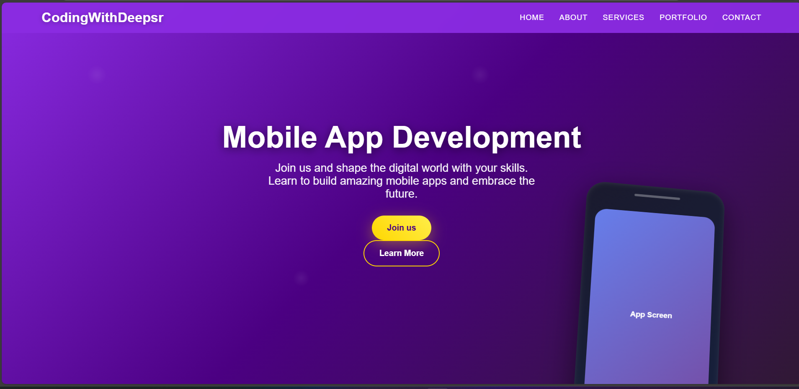

# Mobile App Landing Page

A modern and responsive mobile app landing page built using HTML, CSS, and JavaScript.  
This project features a clean UI design with a gradient background, navigation bar, hero section, and call-to-action buttons.

---
## 🔗 Live Demo

➡️ https://deepali-kumari-iitp.github.io/mobile-app-landing-page/


## 🚀 Features

- Responsive navigation bar with hamburger menu
- Modern hero section with gradient background
- Call-to-action buttons (Join Us, Learn More)
- Mobile app mockup UI
- Clean and simple UI design
- Fully responsive layout

---

## 🛠️ Technologies Used

- HTML5  
- CSS3  
- JavaScript  

---

## 📁 Project Structure

mobile-app-landing-page/
│
├── index.html
├── css/
│ └── style.css
├── js/
│ └── main.js
├── assets/
│ └── landingPage.png
└── README.md


---

## 📸 Preview



---

## 🎯 Purpose

This project was created for frontend practice and to improve skills in responsive web design using HTML, CSS, and JavaScript.

---

## 📌 How to Run

1. Clone the repository  
   ```bash
   git clone git@github.com:YOUR_USERNAME/mobile-app-landing-page.git
2. Open index.html in your browser

👩‍💻 Author

Deepali Kumari
Frontend Developer | Web Development Enthusiast
